# Rising Waters: leakage-aware flood classification experiment

This repository is a small, reproducible classification study built around a historical rainfall dataset. It demonstrates auditing, leakage prevention, baselines, model comparison, bounded tuning, interpretation, and consistent Flask inference.

It is **not a flood-warning system**. The dataset has no documented source, geography, timestamps, or label-generation method, so the model must not be used for safety decisions.

## Problem and data

The binary target `flood` contains 115 rows: 99 non-flood (86.09%) and 16 flood (13.91%). There are ten original numeric features covering temperature, humidity, cloud cover, rainfall aggregates, `avgjune`, and an undocumented `sub` field. There are no missing values or duplicate rows.

The audit found two critical properties:

- `ANNUAL` is the sum of the four seasonal rainfall fields to within 0.1 mm.
- `Jun-Sep > 2400` reproduces all 115 target labels exactly.

That perfect threshold may mean the label was defined from June–September rainfall or that same-period information is being used as a forecast input. Because label provenance and prediction timing are unknown, the primary experiment excludes `ANNUAL` and `Jun-Sep`. The eight modeled features are:

```text
Temp, Humidity, Cloud Cover, Jan-Feb, Mar-May, Oct-Dec, avgjune, sub
```

This ablation makes the result less impressive but more scientifically defensible. The meanings of `avgjune` and `sub` remain undocumented and are a material limitation.

## Methodology

1. Load and validate the untouched raw Excel file.
2. Make one stratified 80/20 split with random seed 42: 92 training rows and 23 untouched test rows.
3. Compare all models with the same five-fold shuffled `StratifiedKFold` partitions on the training set.
4. Fit preprocessing inside each model pipeline. Logistic Regression receives standardized inputs; tree models do not.
5. Use class weighting instead of synthetic resampling. No evidence justified SMOTE on this tiny dataset.
6. Tune only the two strongest untuned candidates by cross-validation recall: Logistic Regression and XGBoost.
7. Select using mean training-fold recall, then F1 and ROC-AUC as tie-breakers. Evaluate the selected model once on the untouched test set.

Recall receives priority because a false negative—classifying an actual flood as safe—is the more harmful error. Precision still matters because excessive false alerts can create alarm fatigue.

## Results

CV values below are means across five training-only folds. Test contains 20 negative and only 3 positive rows, so every test metric has high uncertainty.

| Model | CV Accuracy | CV Precision | CV Recall | CV F1 | CV ROC-AUC | Test Accuracy | Test Precision | Test Recall | Test F1 | Test ROC-AUC |
|---|---:|---:|---:|---:|---:|---:|---:|---:|---:|---:|
| Dummy majority | 0.8591 | 0.0000 | 0.0000 | 0.0000 | 0.5000 | 0.8696 | 0.0000 | 0.0000 | 0.0000 | 0.5000 |
| Logistic Regression | 0.7287 | 0.3383 | 0.6333 | 0.4178 | 0.7960 | 0.8261 | 0.4000 | 0.6667 | 0.5000 | 0.6833 |
| Decision Tree | 0.7287 | 0.1967 | 0.4000 | 0.2571 | 0.5925 | 0.7826 | 0.0000 | 0.0000 | 0.0000 | 0.4500 |
| Random Forest | 0.8368 | 0.0000 | 0.0000 | 0.0000 | 0.7814 | 0.8261 | 0.0000 | 0.0000 | 0.0000 | 0.7000 |
| XGBoost | 0.8246 | 0.5067 | 0.3000 | 0.3238 | 0.7149 | 0.8696 | 0.5000 | 0.6667 | 0.5714 | 0.7000 |
| Logistic Regression (tuned) | 0.7719 | 0.3690 | **0.7000** | 0.4605 | **0.8110** | 0.8261 | 0.4000 | 0.6667 | 0.5000 | 0.6500 |
| XGBoost (tuned) | 0.8152 | 0.5033 | 0.5333 | **0.4810** | 0.6857 | 0.8696 | 0.5000 | 0.6667 | **0.5714** | **0.7167** |

The majority baseline has higher test accuracy than the selected model but misses every flood. This is why accuracy alone is unsuitable.

### Tuning

Logistic Regression tested `C ∈ {0.01, 0.1, 1, 10}` with and without balanced class weights. The selected setting was `C=0.01, class_weight="balanced"`. Its mean CV recall improved from 0.6333 to 0.7000 and CV F1 from 0.4178 to 0.4605, although holdout F1 remained 0.5000.

XGBoost tested 96 combinations across estimator count, depth, learning rate, subsampling, and column sampling. Its selected setting was 100 estimators, depth 3, learning rate 0.03, and full row/column sampling. Tuning raised CV recall from 0.3000 to 0.5333 and CV F1 from 0.3238 to 0.4810.

## Final model

Tuned Logistic Regression was selected because it had the highest training-fold recall, the highest training-fold ROC-AUC, direct coefficient interpretation, and low inference cost. Its test confusion matrix is:

```text
                 Predicted 0  Predicted 1
Actual 0              17            3
Actual 1               1            2
```

The displayed probability is an uncalibrated model score. It must not be interpreted as a validated real-world probability of flooding.

Detailed machine-readable results are in [`reports/metrics.json`](reports/metrics.json), [`reports/model_comparison.csv`](reports/model_comparison.csv), and [`reports/test_predictions.csv`](reports/test_predictions.csv).

## Visualizations

### Target balance

The dataset is strongly imbalanced: only 16 of 115 rows are positive.

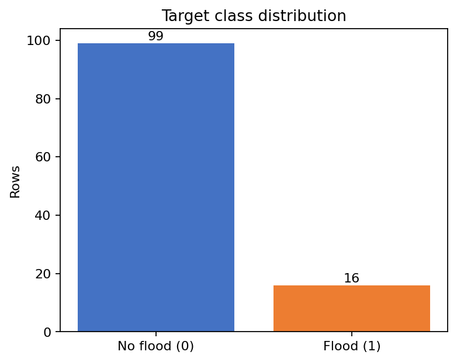

### Feature distributions

These histograms expose the small sample size, discrete weather measurements, skew, and extreme rainfall observations.

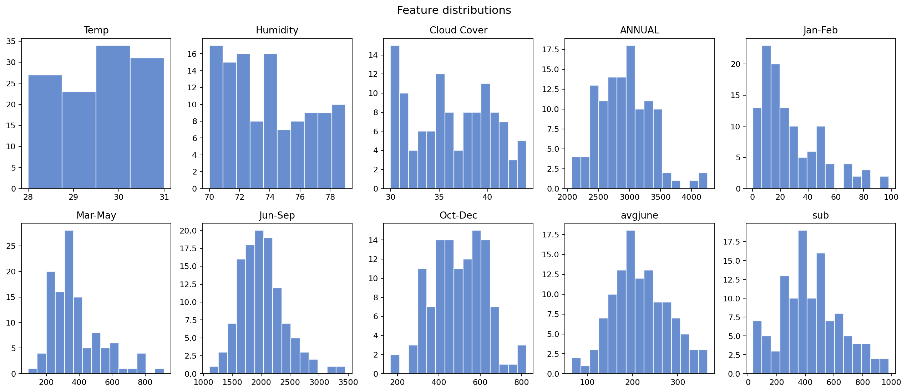

### Correlation and redundancy

The matrix highlights the strong relationship between `ANNUAL` and `Jun-Sep`, as well as correlation between `avgjune` and `sub`.

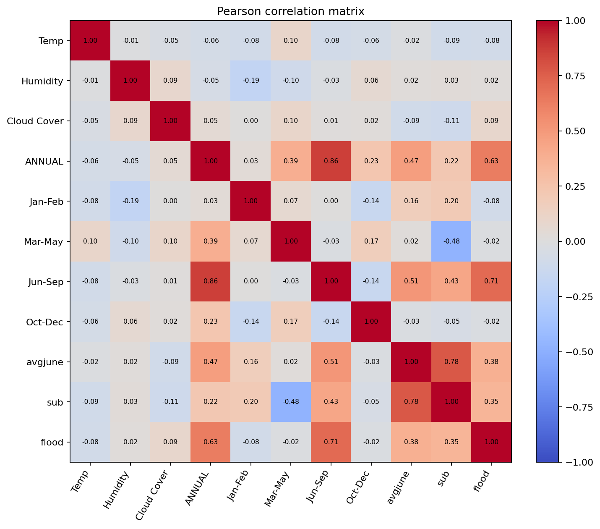

### Final-model errors

The selected tuned Logistic Regression detected two of three test floods, missed one, and produced three false alerts.

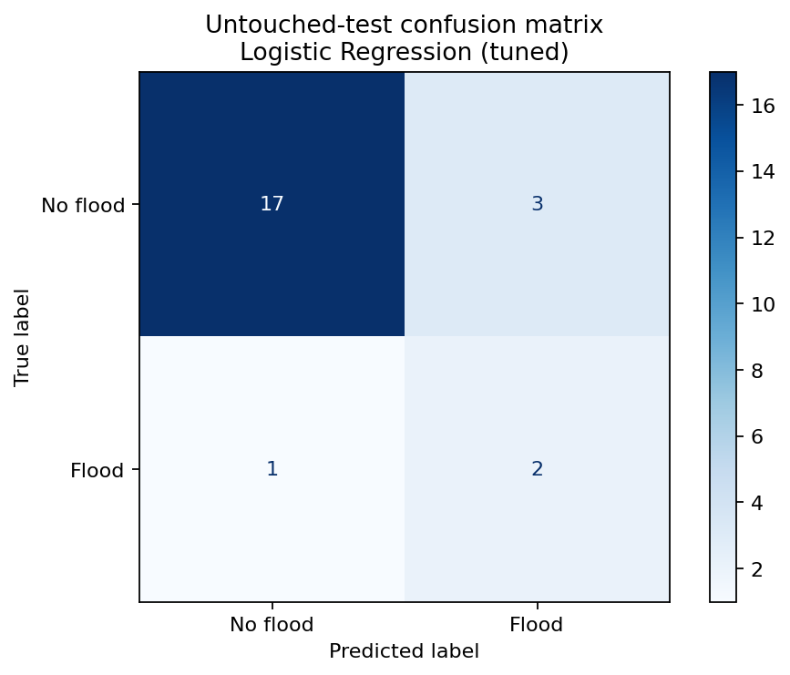

### ROC comparison

ROC curves compare ranking behavior on the untouched test set. Because it contains only three positive rows, small differences must not be overinterpreted.

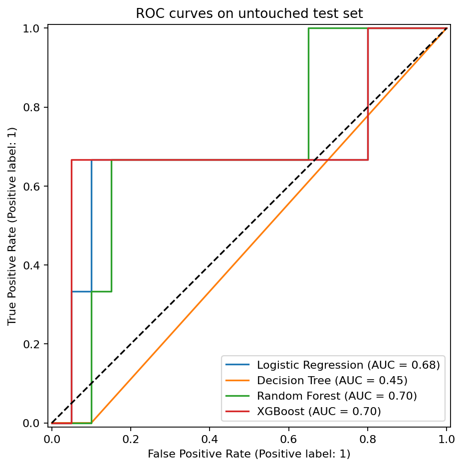

### Model interpretation

The selected-model view and coefficient plot show how standardized inputs influence the Logistic Regression score.

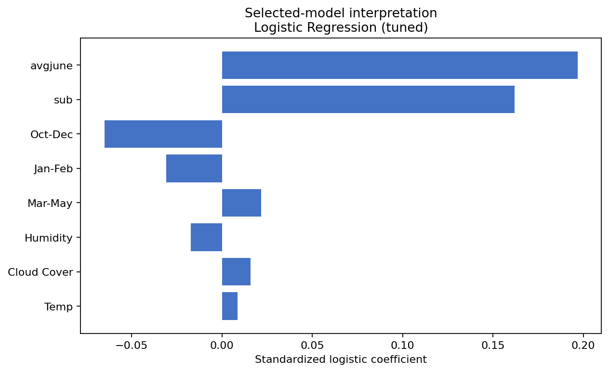

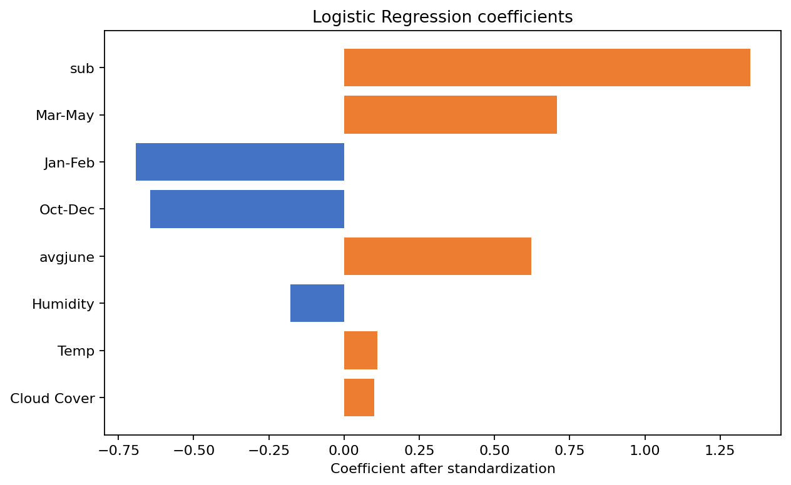

Correlation, coefficients, and feature importance describe associations in this dataset. They do not establish causation.

## Reproduce

Requires Python 3.13 (the saved artifact records Python and library versions).

```bash
python -m pip install -r requirements.txt
python -m src.train
python analysis/generate_figures.py
python -m src.evaluate
python -m pytest
python app/app.py
```

Open `http://127.0.0.1:5000`. Flask loads one serialized pipeline containing the exact training preprocessing and estimator. Inputs are converted to a named DataFrame, checked for missing/unexpected fields, validated against observed dataset ranges, and passed to the pipeline without duplicated scaling code.

## 📸 Screenshots

> *Explore the current user interface of Rising Waters.*

| Home Page | Introduction Page |
|---|---|
| 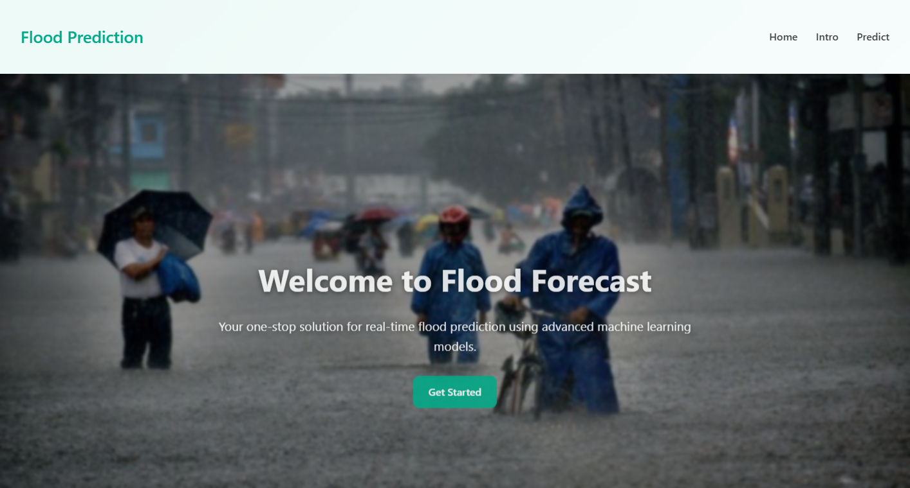 | 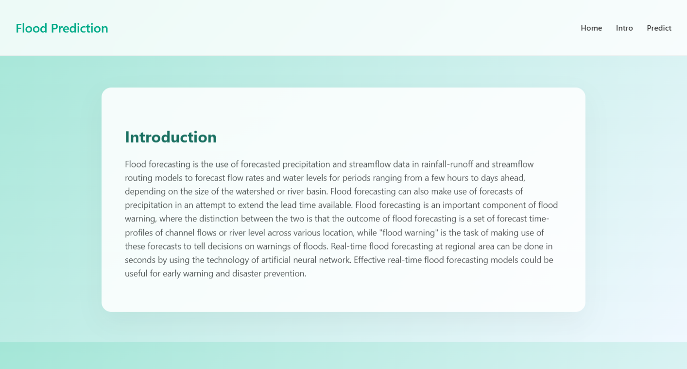 |

| Prediction Form | Prediction Result |
|---|---|
| 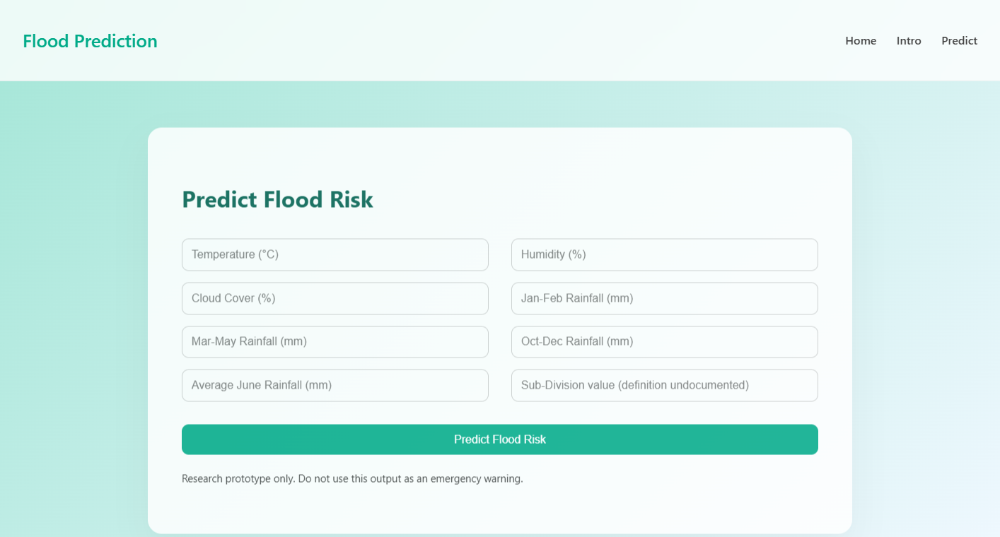 | 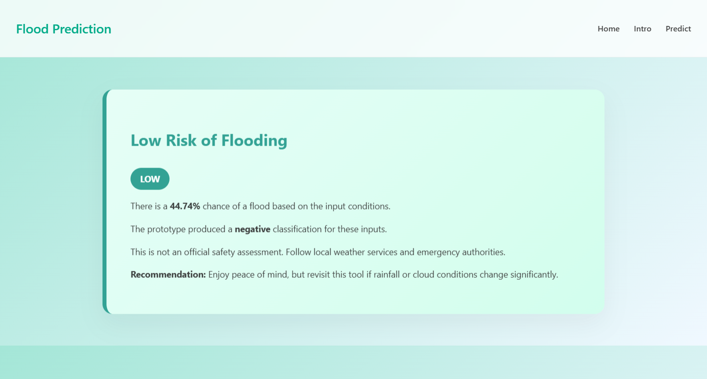 |

These screenshots show the leakage-aware eight-field form and the prototype safety language used by the current application.

## Project structure

```text
analysis/   reproducible EDA and evaluation figures
app/        Flask UI
data/       original and legacy-cleaned Excel datasets
models/     selected pipeline and metadata (plus legacy artifacts)
notebooks/  original exploratory notebooks retained for audit history
reports/    exact metrics, predictions, figures, and interview audit
src/        data validation, pipelines, training, evaluation, inference
tests/      schema, preprocessing, loading, prediction, and Flask tests
```

## Limitations

- Only 115 rows and 16 positive cases; the test set contains only three floods.
- Dataset source, sampling process, geography, dates, label definition, and units for some fields are undocumented.
- No temporal or external validation is possible from the supplied data.
- The label is perfectly determined by a threshold on an excluded feature, making label provenance suspect.
- Excluding suspicious features reduces leakage risk but does not prove the remaining variables are available at prediction time.
- Probabilities are not calibrated and no operating threshold was validated with domain experts.
- Distribution shift, sensor failures, and changing climate patterns are untested.
- The Flask application is a portfolio demonstration, not a monitored production service or public warning tool.
